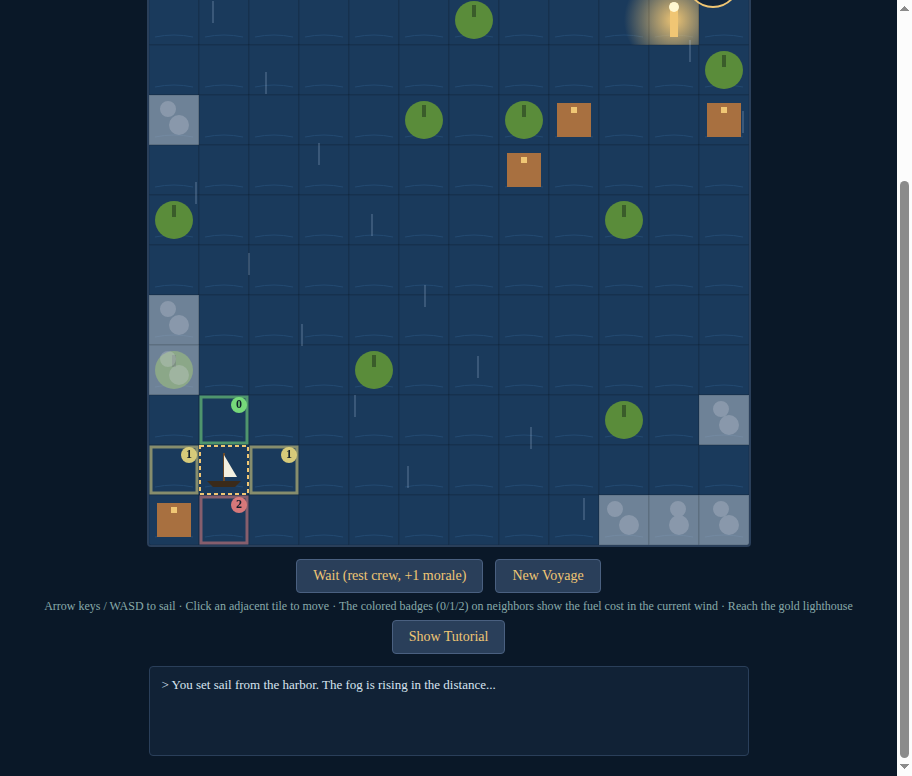

# The Last Lighthouse

A solo nautical strategy board game in your browser.

A storm devours the sea. You captain a small ship and must reach the last functioning lighthouse before the fog claims you, your fuel runs out, or the crew breaks.

**Play it:** https://nichtagentur.github.io/last-lighthouse/

## How to play

- **Arrow keys / WASD** to sail (or click any tile adjacent to your ship)
- Each move uses **fuel** and lets the **fog spread** by one turn
- Read the **wind**: sail with it for free (and a chance of a bonus drift), against it for double cost
- Cost badges on neighbouring tiles preview the fuel cost in the current wind:
  - **Green 0** — with the wind, free
  - **Yellow 1** — cross wind, normal cost
  - **Red 2** — against the wind, slow going
- Refuel at green islands and brown ports. Ports also give a morale boost
- Reach the **gold lighthouse** in the far corner to win

## Single file

Everything is in `index.html` — pure HTML5 / Canvas 2D / vanilla JS, no build step, no dependencies. Open the file locally or host the directory anywhere.

## License

MIT.
